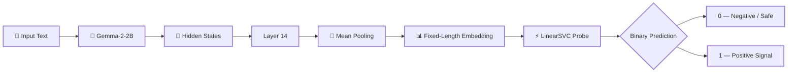

<div align="center">

# 🧠 Latent Probing for Toxicity Detection

### Probing Gemma-2-2B's Internal Representations with a Linear Classifier

<p>
  <strong>Can safety-related information be decoded directly from an LLM's hidden states?</strong>
</p>

<br>


<br>

**Latent Probe Challenge · Gemma-2-2B · Layer 14 · Linear SVM**

</div>

---

## 🔬 Overview

This project investigates whether a simple linear classifier can recover safety-related information from the **internal representations of a large language model**, rather than relying on the model's final generated output.

The project was developed for the **LATENT PROBE CHALLENGE — TOXICITY DETECTION**, where participants were given latent representations extracted from Google's **Gemma-2-2B** model and asked to predict a binary target.

The central idea is simple:

> **Instead of training a classifier directly on text, train it on what the language model internally represents about that text.**

The experiment uses:

* **Model:** `google/gemma-2-2b`
* **Representation:** hidden state from **Layer 14**
* **Maximum sequence length:** 64 tokens
* **Pooling:** mean pooling across non-padding tokens
* **Probe:** Linear Support Vector Machine (`LinearSVC`)
* **Prediction:** binary `0 / 1`

---

## 🎯 Research Question

The project explores a broader interpretability question:

> **Does a frozen language model's intermediate representation contain enough linearly separable information to identify safety-related signals?**

Rather than fine-tuning Gemma, the language model is kept frozen.

Only a lightweight classifier is trained on top of its latent representation.

This makes the experiment a form of **linear probing**.

---

## 🧩 Core Architecture



### Why Layer 14?

The competition specification identified **Layer 14** as the strongest-performing representation among the evaluated Gemma hidden-state layers.

The model has hidden-state indices `0–26`, with Layer 14 providing the representation used for the official task.

The probe therefore operates on:

```text
Gemma-2-2B
     │
     ├── Layer 0
     ├── Layer 1
     ├── ...
     ├── Layer 14  ← selected representation
     ├── ...
     └── Layer 26
```

---

# 🧠 What Is Latent Probing?

A language model transforms text into increasingly rich internal representations as information moves through its layers.

A **probe** asks:

> "Is information about a particular property already encoded in this representation?"

For this project:

```text
Text
  ↓
Frozen Gemma
  ↓
Intermediate Representation
  ↓
Simple Linear Classifier
  ↓
Prediction
```

The classifier itself is intentionally simple.

The interesting question is therefore not:

> "Can a powerful neural network learn toxicity?"

but rather:

> **"Is the relevant information already present in the model's latent representation?"**

---

# ⚙️ Method

## 1. Tokenization

Input text is tokenized using Gemma's tokenizer.

The maximum sequence length is restricted to:

```text
64 tokens
```

This matches the competition specification.

---

## 2. Hidden-State Extraction

Gemma is executed with hidden states enabled.

The representation from Layer 14 is selected:

```python
hidden_states[14]
```

The language model is **not fine-tuned** during probe training.

---

## 3. Mean Pooling

Instead of using only the final token, the representation is averaged across the valid tokens.

Conceptually:

```text
Token 1 ─┐
Token 2  │
Token 3  │
Token 4  ├──→ Mean → Layer-14 embedding
...      │
Token N ─┘
```

Padding positions are excluded from the mean.

This produces one fixed-length vector for every input.

---

## 4. Linear Probe

The resulting embeddings are passed to a `LinearSVC`.

The probe searches for a linear decision boundary:

```text
             Class 1
                ●
             ●  ●
          ●
----------------------------  ← decision boundary
      ●
   ●     ●
 Class 0
```

The language model remains frozen.

Only the classifier learns.

---

# 📊 Experimental Configuration

| Component                 | Configuration             |
| ------------------------- | ------------------------- |
| Language model            | Gemma-2-2B                |
| Framework                 | Hugging Face Transformers |
| Representation            | Hidden state              |
| Selected layer            | **14**                    |
| Total hidden-state layers | 27                        |
| Maximum tokens            | **64**                    |
| Pooling                   | Mean pooling              |
| Padding                   | Excluded from pooling     |
| Probe                     | LinearSVC                 |
| Output                    | Binary `0 / 1`            |
| Evaluation metric         | Accuracy                  |

---

# 🏋️ Training Pipeline

The repository contains a complete local training pipeline.

```text
                    TRAINING
                       │
                       ▼
             ┌──────────────────┐
             │ External Dataset │
             └────────┬─────────┘
                      │
                      ▼
             ┌──────────────────┐
             │ Gemma Tokenizer  │
             └────────┬─────────┘
                      │
                      ▼
             ┌──────────────────┐
             │   Gemma-2-2B     │
             │    Frozen        │
             └────────┬─────────┘
                      │
                      ▼
             ┌──────────────────┐
             │    Layer 14      │
             └────────┬─────────┘
                      │
                      ▼
             ┌──────────────────┐
             │  Mean Pooling    │
             └────────┬─────────┘
                      │
                      ▼
             ┌──────────────────┐
             │  LinearSVC Probe │
             └────────┬─────────┘
                      │
                      ▼
             trained_probe.joblib
```

---

# 📁 Repository Structure

```text
latent-probing-toxicity/
│
├── README.md
│
├── train_probe.py
│   └── Dataset preparation, Gemma embedding extraction,
│       probe training and model serialization
│
├── classifier.py
│   └── CodaBench-compatible inference wrapper
│
├── requirements.txt
│   └── Python dependencies
│
└── LICENSE
```

---

# 🚀 Quick Start

## 1. Clone the repository

```bash
git clone https://github.com/rahulkiran2222/latent-probing-toxicity.git
cd latent-probing-toxicity
```

---

## 2. Install dependencies

```bash
pip install -r requirements.txt
```

---

## 3. Authenticate with Hugging Face

Gemma-2-2B requires access to the model repository.

Make sure your Hugging Face account has access to the model and authenticate locally:

```python
from huggingface_hub import login

login()
```

---

## 4. Train a fast 12K-sample probe

For a quick experiment:

```bash
python train_probe.py --max_samples 12000 --batch_size 8
```

This performs:

```text
Dataset
   ↓
Tokenization
   ↓
Gemma-2-2B
   ↓
Layer 14 embeddings
   ↓
Linear probe search
   ↓
Validation
   ↓
trained_probe.joblib
```

---

## 5. Train using the complete available corpus

```bash
python train_probe.py --batch_size 8
```

Training can be substantially faster on a CUDA-enabled GPU.

---

## 6. Reuse previously generated embeddings

If embedding extraction has already completed and the process was interrupted:

```bash
python train_probe.py --reuse_embeddings --batch_size 8
```

This avoids repeating the expensive Gemma inference stage.

---

# 💾 CodaBench Submission

The competition required a lightweight inference package rather than training on the evaluation server.

The final submission contains:

```text
submission.zip
│
├── classifier.py
└── trained_probe.joblib
```

Both files must be located at the **root of the ZIP archive**.

The platform loads:

```python
Classifier()
```

and calls:

```python
predict(X)
```

The submitted classifier then loads the serialized probe and generates predictions.

---

# 🧪 Results

The experiment produced an important distinction between **local validation performance** and **official hidden evaluation performance**.

| Evaluation                  |   Accuracy |
| --------------------------- | ---------: |
| Local validation            | **92.58%** |
| CodaBench hidden evaluation |   **~53%** |
| Final leaderboard position  |    **8th** |

### Interpretation

The high local validation score did **not** transfer to the hidden competition evaluation.

This strongly suggests that the external training distribution differed substantially from the hidden evaluation distribution.

In other words:

```text
Strong local validation
          │
          ▼
     92.58%
          │
          │  distribution shift
          ▼
Hidden evaluation
          │
          ▼
       ~53%
```

This is not simply a failure of the classifier.

It is an important experimental observation about **probe transferability**.

---

# ⚠️ Dataset & Distribution-Shift Limitation

The competition environment did not expose the expected public training data through the participant interface available during this experiment.

As a result, the local training pipeline used an externally available mental-health classification corpus.

The labels were mapped as:

```text
Normal
  ↓
0

Distress-related classes
  ↓
1
```

This allowed us to build and test the complete latent-probing pipeline, but it introduced a major limitation:

> **The external training distribution may not match the competition's hidden evaluation distribution.**

Therefore, the 92.58% local validation result should **not** be interpreted as an estimate of competition performance.

The official hidden result provides the more relevant measure of generalization to the competition's evaluation distribution.

---

# 🔍 Why This Experiment Is Interesting

A conventional approach might fine-tune the language model itself.

This project deliberately takes a different approach.

### Conventional fine-tuning

```text
Text
 ↓
LLM
 ↓
Update millions/billions of parameters
 ↓
Prediction
```

### Latent probing

```text
Text
 ↓
Frozen LLM
 ↓
Extract internal representation
 ↓
Train tiny linear classifier
 ↓
Prediction
```

The second approach lets us investigate the information already encoded inside the model.

This makes latent probing useful for:

* interpretability research
* representation analysis
* model auditing
* safety research
* feature discovery
* mechanistic investigations
* studying where information emerges across model layers

---

# 🧠 Key Takeaways

### 1. Intermediate representations contain useful signal

A simple linear classifier achieved strong local validation performance using only Gemma's Layer-14 representations.

### 2. Probe performance is distribution-dependent

The large difference between local validation and hidden evaluation demonstrates that a probe can perform well on one distribution while generalizing poorly to another.

### 3. Frozen-model probing is computationally attractive

The expensive language model does not need to be fine-tuned.

Once embeddings are extracted, probe experiments become comparatively lightweight.

### 4. The probe itself is not the entire story

The choice of:

* dataset
* representation layer
* pooling strategy
* tokenization
* label definition
* training distribution

can strongly influence results.

---

# 🛠️ Design Decisions

## Why LinearSVC?

A linear probe is intentionally simple.

If a linear classifier performs well, it provides evidence that the target information is relatively accessible in the representation without requiring a highly nonlinear classifier.

---

## Why Mean Pooling?

The competition specification used mean pooling over the token representations.

The implementation follows that setup rather than relying on only the final token.

---

## Why Freeze Gemma?

Freezing the base model isolates the representation itself as the object of investigation.

The experiment therefore asks whether the information is already encoded rather than whether a fine-tuned model can learn it.

---

# 🔬 Reproducibility

The main experiment is implemented in:

```text
train_probe.py
```

The CodaBench inference interface is implemented in:

```text
classifier.py
```

The environment is specified in:

```text
requirements.txt
```

For reproducible experiments, it is recommended to use the same:

* model checkpoint
* tokenizer
* sequence length
* pooling strategy
* layer index
* classifier configuration
* dependency versions

---

# 📦 Generated Artifacts

The training pipeline can generate artifacts such as:

```text
trained_probe.joblib
probe_report.json
layer14_embeddings.npz
```

### `trained_probe.joblib`

Serialized trained linear probe used during inference.

### `probe_report.json`

Stores training/validation information and selected probe configuration.

### `layer14_embeddings.npz`

Cached Layer-14 representations that can be reused for subsequent probe experiments.

---

# 🔐 Model Access

Gemma-2-2B is a gated model.

Users attempting to reproduce this experiment should obtain the required model access through their Hugging Face account before running the embedding extraction pipeline.

No Hugging Face credentials should ever be committed to this repository.

---

# 🧭 Future Experiments

The current project establishes the basic latent-probing pipeline.

Potential future experiments include:

* [ ] Train directly on the competition's official embedding distribution
* [ ] Compare Layers 5, 10, 14, 18 and 23
* [ ] Compare mean pooling with last-token pooling
* [ ] Compare LinearSVC with logistic regression
* [ ] Evaluate nonlinear probes
* [ ] Investigate probe calibration
* [ ] Analyze class imbalance
* [ ] Visualize latent representations using PCA
* [ ] Visualize latent representations using UMAP
* [ ] Measure representation similarity across layers
* [ ] Study robustness under paraphrasing
* [ ] Evaluate cross-dataset generalization
* [ ] Investigate whether safety-related information emerges gradually across layers

---

# 🧪 Possible Research Extension

One particularly interesting extension is **layer-wise probing**.

Instead of asking only:

> "Can Layer 14 predict the target?"

we can ask:

> **"At which layer does the relevant information become linearly decodable?"**

Conceptually:

```text
Layer 0   ──→ Probe ──→ Accuracy
Layer 1   ──→ Probe ──→ Accuracy
Layer 2   ──→ Probe ──→ Accuracy
   ⋮
Layer 14  ──→ Probe ──→ Accuracy ⭐
   ⋮
Layer 26  ──→ Probe ──→ Accuracy
```

This turns the project from a simple classifier into a potential **representation-analysis experiment**.

---

# 🏆 Competition Outcome

This repository was developed as part of the:

**LATENT PROBE CHALLENGE — TOXICITY DETECTION**

Final recorded result:

```text
Leaderboard position: 8th
Official accuracy:    ~0.53
```

The competition result is documented here primarily as an empirical evaluation of the complete pipeline.

The stronger contribution of this repository is the reproducible workflow for:

```text
LLM
 ↓
Intermediate Representation
 ↓
Latent Embedding
 ↓
Linear Probe
 ↓
Evaluation
```

---

# 📚 Technical Summary

```text
Model
    Gemma-2-2B

Representation
    Hidden State — Layer 14

Input
    Maximum 64 tokens

Pooling
    Mean pooling over valid tokens

Probe
    Linear Support Vector Machine

Training
    Frozen language model + trainable probe

Output
    Binary classification

Primary metric
    Accuracy

Local validation
    92.58%

Official hidden evaluation
    ~53%

Leaderboard position
    8th
```

---

# 👨‍💻 Author

**Rahul Kiran**

Machine Learning · Generative AI · Representation Learning · AI Safety

GitHub: `rahulkiran2222`

---

# 📄 License

This project is released under the **MIT License**.

See [`LICENSE`](LICENSE) for details.

---

<div align="center">

### 🧠 Probe the representation.

### 🔍 Understand the signal.

### 🤖 Don't just study what the model says — study what it encodes.

<br>

**Built with Python · PyTorch · Transformers · Gemma · scikit-learn**

</div>
